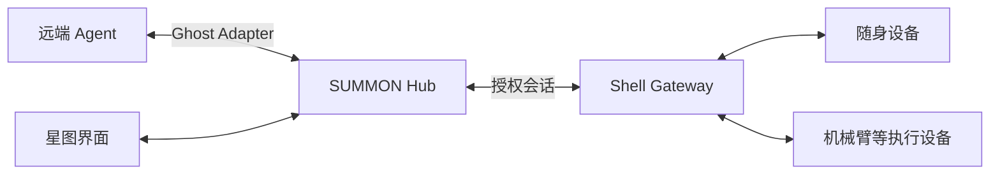

# 唤名 SUMMON

**唤一个名字，让熟悉的 Agent 来到身边。**

*Ghost lives on the network. Bodies can change.*

SUMMON 探索一种跨设备的 Agent 体验：让运行在远端的智能体接入身边的设备，带着已保存的偏好继续与你互动。从一块随身屏幕到展台上的机械臂，交互的形态可以改变，陪你完成任务的仍是同一个 Agent。

本项目为 **EvoTavern 进化酒馆黑客松 · 深圳站**（2026-09-21 ~ 09-24）赛道 01「具身与穿戴硬件」的参赛参考实现，当前处于契约阶段。

[协议文档](docs/PROTOCOL.md) · [接入指南](docs/ADAPTER.md) · [消息样例](protocol/examples/README.md)

## 同一个 Agent，不同的身体

我们希望你可以在随身设备上与 Agent 聊一件展品，告诉它“下次先用一句话介绍”。走到另一处展台，再次唤起它时，它能沿用这个偏好，并借助现场设备继续讲解或指向对应的展品。

SUMMON 围绕这段体验设计三个环节：

- **唤名**：找到熟悉的 Agent，选择它可以使用的设备。
- **接驳**：Agent 通过设备提供的能力显示内容、播放语音或执行动作。
- **延续**：保存经过确认的偏好，在设备交接后继续使用。

星图是这段体验的可视化入口：每个节点对应一个 Agent，呈现它的在线状态、当前连接与交接过程。

## 如何连接

Agent 保持在原有电脑或服务器上运行，通过 SUMMON Hub 与现场的 Shell Gateway 通信。Gateway 将统一的动作请求转换为设备调用，并返回执行结果。



| 组成 | 作用 |
|---|---|
| Ghost Adapter | 连接已有 Agent，将设备能力提供为可调用工具 |
| SUMMON Hub | 管理身份、会话、记忆与设备交接 |
| Shell Gateway | 适配本地硬件，执行允许的动作并回传结果 |
| 星图界面 | 浏览 Agent、发起连接、查看交互状态 |

协议将设备能力、控制权和执行回执分开描述。每次接入都有明确的会话，设备交接经过停止确认，偏好更新带有版本记录。具体约定见 [公共契约](docs/PROTOCOL.md)。

## 开发进展

项目处于早期开发阶段，当前版本为 **契约 v0.1.0**。仓库已提供协议文档、JSON Schema、交互样例与校验工具，下一阶段将实现运行服务并开展硬件联调。首个验证方向是基于 FoloToy AI Passport 的跨设备导览，机械臂接入作为后续扩展。

开发者可以先阅读 [接入指南](docs/ADAPTER.md)，使用 [场景样例](protocol/examples/README.md) 对齐消息与状态，再接入具体的 Agent 或设备。

要移植到自己的硬件，从 [固件移植手册](docs/FIRMWARE.md) 开始：只需实现 `summon_port_t` 一个结构体。**该模板不提供物理急停，急停必须是你自己的硬件。**

在仓库根目录运行契约校验（推荐 Python 3.10+）：

```sh
python -m pip install -r protocol/requirements.txt
python tools/validate_contract.py
```

此命令检查消息结构、样例时序和文档链接；服务联调与实物验证见 [验收说明](docs/ACCEPTANCE.md)。

## 文档

| 文档 | 内容 |
|---|---|
| [协议规范](docs/PROTOCOL.md) | 身份、接口、会话、动作与记忆 |
| [JSON Schema](protocol/summon.schema.json) | 可校验的消息定义 |
| [接入指南](docs/ADAPTER.md) | Agent 与设备适配流程 |
| [硬件与部署](docs/HARDWARE.md) | 设备基线、网关与网络连接 |
| [星图设计](docs/NEBULA.md) | 界面交互与状态呈现 |
| [固件移植](docs/FIRMWARE.md) | `summon_port_t` 逐字段说明、六条板侧规则的框架强制点 |
| [项目方案](docs/方案书.md) | 应用场景与设计方向 |
| [执行计划](docs/PLAN.md) | 三人分工、倒排与范围边界 |

## License

[MIT](LICENSE)
