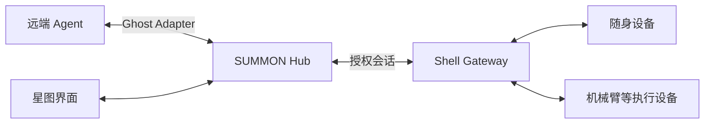

<p align="center">
  <a href="https://summon.entermodetwo.com/">
    
  </a>
</p>

<h1 align="center">唤名 SUMMON</h1>

<p align="center"><strong>唤一个名字，让熟悉的 Agent 来到身边。</strong></p>

<p align="center"><em>Ghost lives on the network. Bodies can change.</em></p>

SUMMON 探索一种跨设备的 Agent 体验：让运行在远端的智能体接入身边的设备，带着已保存的偏好继续与你互动。从一块随身屏幕到展台上的机械臂，交互的形态可以改变，陪你完成任务的仍是同一个 Agent。

本项目为 **EvoTavern 进化酒馆黑客松 · 深圳站**（2026-09-21 ~ 09-24）赛道 01「具身与穿戴硬件」的参赛实现，已打通 Passport 语音控制 B601-DM 机械臂的实物演示链路。

<p align="center">
  <a href="docs/PROTOCOL.md">协议文档</a> ·
  <a href="docs/ADAPTER.md">接入指南</a> ·
  <a href="protocol/examples/README.md">消息样例</a>
</p>

## 重大更新

### 2026-09-22 · Passport 语音控制机械臂

已完成从 **对 Passport 说话** 到 **现场 B601-DM 机械臂执行动作** 的联调：Passport 将语音送入云端，Agent 在授权会话中选择预设手势，SUMMON Hub 把 `arm.gesture` 下发给现场笔记本的 Gateway；本机 Arm Console 通过 MotorBridge 控制机械臂，并将执行回执送回。

**Passport → 云端 Agent → SUMMON Hub → 现场 Gateway → Arm Console / MotorBridge → B601-DM**

当前演示使用现场配置的短手势，如点头、挥手和指向左／中／右；远端 Agent 不直接发送任意关节角度。实现与复现步骤见 [Gateway 接入说明](docs/GATEWAY.md#笔记本作为-b601-dm-gateway) 和 [机械臂控制台](arm-console/README.md)。后续重大进展会按日期记录在本节，最新更新置顶。

## 同一个 Agent，不同的身体

我们希望你可以在随身设备上与 Agent 聊一件展品，告诉它“下次先用一句话介绍”。走到另一处展台，再次唤起它时，它能沿用这个偏好，并借助现场设备继续讲解或指向对应的展品。

SUMMON 围绕这段体验设计三个环节：

- **唤名**：找到熟悉的 Agent，选择它可以使用的设备。
- **接驳**：Agent 通过设备提供的能力显示内容、播放语音或执行动作。
- **延续**：保存经过确认的偏好，在设备交接后继续使用。

星图是这段体验的可视化入口：每个节点对应一个 Agent，呈现它的在线状态、当前连接与交接过程。

## 如何连接

Agent 保持在原有电脑或服务器上运行，通过 SUMMON Hub 与现场的 Shell Gateway 通信。Gateway 将统一的动作请求转换为设备调用，并返回执行结果。

独立 [SUMMON Gateway](docs/GATEWAY.md) 提供终端显示、USB 串口显示桥和 B601-DM 机械臂控制台适配器：在现场电脑运行 `python -m gateway --config <私有配置路径>`。这台电脑作为中转节点，主动连 Hub；远端设备上的 Agent 经 Hub 授权后使用本地设备能力。机械臂需要控制台先显式连接实机并完成现场停止与短动作验收。

**经验上传声明：接入后执行结果会上传配置的云端 Hub，按账号、设备版本和运行模式隔离，用于经验统计与 Agent 检索。** 专用经验表不保存对话、音视频或动作原始参数；普通命令表仍保留协议请求与回执。断网结果本地排队，恢复只补传证据，不重放动作；默认不公开给其他账号。



| 组成 | 作用 |
|---|---|
| Ghost Adapter | 连接已有 Agent，将设备能力提供为可调用工具 |
| SUMMON Hub | 管理身份、会话、记忆与设备交接 |
| Shell Gateway | 适配本地硬件，执行允许的动作并回传结果 |
| 星图界面 | 浏览 Agent、发起连接、查看交互状态 |

协议将设备能力、控制权和执行回执分开描述。每次接入都有明确的会话，设备交接经过停止确认，偏好更新带有版本记录。具体约定见 [公共契约](docs/PROTOCOL.md)。

## 开发进展

当前版本为 **契约 v0.1.0**。仓库提供 Hub、Web 控制台、模拟 Agent/设备、SQLite 记忆与设备经验库。可以验证召唤、交接、偏好保存、执行证据入库与执行前检索。公开网页仍展示 SIMULATED 环境；Passport 到 B601-DM 的语音控制已完成实物联调。B601-DM 可运行[本地 LIVE Agent 实机演示](docs/ARM-LIVE-DEMO.md)：模型先读取六轴实测姿态，再在现场开放的角度窗口内生成动作，笔记本 Gateway 检查模型边界并等待控制器实测回执。跨设备使用按 [Gateway 部署说明](docs/GATEWAY.md#笔记本作为-b601-dm-gateway) 配置 HTTPS Hub 权限。

### B601-DM 机械臂本地工具

[`arm-console/`](arm-console/README.md) 提供基于仓库内 DM URDF/STL 的三维控制台、仿真和 MotorBridge 实机驱动。本机 Agent 可用 JSON CLI 查询 J1–J7 参数、状态和故障，离线预演 J1–J6 的整段轨迹；预演按不超过 1° 采样模型自碰撞与桌面边界，模型检查失败时不提交目标。

```powershell
.\tools\summon_arm.ps1 describe
.\tools\summon_arm.ps1 preview J3=-6 --from-pose folded
.\tools\summon_arm.ps1 status
.\tools\summon_arm.ps1 move J3=-8 --speed 3 --execute
```

`describe` 和指定起点的 `preview` 无需连接硬件。实机写入需现场控制台已显式连接，并为每个动作添加 `--execute`；超过 10°/s 还需 `--confirm-risk`。多轴使能会先保持 J4，再依次处理 J3/J2；重力模式通过现有后端实验开关调用。本地 CLI 仍可单独使用；远端 Agent 的 `arm.gesture` 则经 [B601-DM Gateway 适配器](docs/GATEWAY.md#笔记本作为-b601-dm-gateway) 进入同一控制台，并在 Gateway 侧重新做模型轨迹检查、租约校验和实机回执确认。完整命令、现场限制与验证方法见 [Arm Console Agent CLI](arm-console/README.md#agent-cli离线可用)。

现场演示通过 [`tools/arm_gesture.py`](tools/arm_gesture.py) 从实机反馈录制相对动作，再以 [`tools/arm_demo.py`](tools/arm_demo.py) 启动私有 LIVE Hub、笔记本 Gateway 和模型 Agent。`arm.observe` 让模型读取六轴状态，`arm.motion` 在现场验证的各轴窗口内规划短动作；[`tools/arm102_teleop.py`](tools/arm102_teleop.py) 提供 COM9 主臂到 COM6 从臂的六轴遥操入口。8°/s 的小幅/明显招手预设已分别由 `deepseek-flash` 选择并在实机收到 `controller_feedback` 完成回执；浏览器页面显示选择依据、关节状态和回执。[启动与录制步骤](docs/ARM-LIVE-DEMO.md) 中的密钥和访问码只存仓库外私有配置。

设备经验按账号、设备、能力、运行模式和版本匹配，提供历史结果与统计建议；它不代表模型训练或已验证的运动技能。见 [经验库接入](docs/EXPERIENCE.md) 与 [部署说明](docs/DEPLOYMENT.md)。

开发者可以先阅读 [接入指南](docs/ADAPTER.md)，使用 [场景样例](protocol/examples/README.md) 对齐消息与状态，再接入具体的 Agent 或设备。

要移植到自己的硬件，从 [固件移植手册](docs/FIRMWARE.md) 开始，结合目标板 BSP、驱动和协议完成实现与实测。**该模板不提供物理急停，急停必须是你自己的硬件。**

在仓库根目录运行契约校验（推荐 Python 3.10+）：

```sh
python -m pip install -r protocol/requirements.txt
python tools/validate_contract.py
```

此命令检查消息结构、样例时序和文档链接；服务联调与实物验证见 [验收说明](docs/ACCEPTANCE.md)。

## 文档

设备接入自动化：[SUMMON 设备接入 Skill](skills/summon-device-onboarding/SKILL.md) · [安装与提示词](web/device-onboarding.md)。先检测硬件与准入条件，再按官方 SDK/BSP 开发网关或固件；不包含通用成品固件。

| 文档 | 内容 |
|---|---|
| [协议规范](docs/PROTOCOL.md) | 身份、接口、会话、动作与记忆 |
| [JSON Schema](protocol/summon.schema.json) | 可校验的消息定义 |
| [接入指南](docs/ADAPTER.md) | Agent 与设备适配流程 |
| [硬件与部署](docs/HARDWARE.md) | 设备基线、网关与网络连接 |
| [星图设计](docs/NEBULA.md) | 界面交互与状态呈现 |
| [固件移植](docs/FIRMWARE.md) | `summon_port_t` 逐字段说明、六条板侧规则的框架强制点 |
| [固件经验沉淀](docs/FIRMWARE-EXPERIENCE.md) | 手机配网、Agent 铭牌、双击确认返回及验证状态 |
| [铭牌与电脑客户端](docs/NAMEPLATES.md) | 已实现的铭牌、浏览器配对授权与 Windows TUI；[原设计](docs/NAMEPLATE-DESIGN.md) |
| [电脑命令执行](docs/COMMANDS.md) | 单独授权的 PowerShell、超时停止、退出码与有界输出 |
| [机械臂控制台与 Agent CLI](arm-console/README.md) | B601-DM 模型、碰撞预演、状态读取与本地执行 |
| [云端打开浏览器](docs/BROWSER-TEST.md) | 精确 URL 白名单和真实桌面测试记录 |
| [项目方案](docs/方案书.md) | 应用场景与设计方向 |
| [执行计划](docs/PLAN.md) | 三人分工、倒排与范围边界 |

## License

[MIT](LICENSE)
