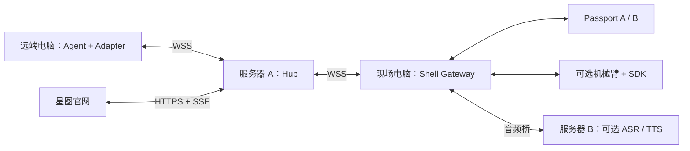

# 唤名 SUMMON

**Ghost 住在网络上，身体可以更换。**

SUMMON 是正在实现的 Agent 与设备接驳协议：按名字找到远端 Agent，让它接入授权设备，继续使用同一份记忆完成任务，再释放或交接控制权。

> 2026-09-20 · 契约 0.1.0 · EvoTavern 深圳站，主赛道 01 CYBERBODY。
> **当前只有文档、JSON Schema、消息样例与契约校验工具。后端、前端、Agent 适配器、固件和实物联调尚未实现。** 样例不代表真实接入数量或硬件测试结果。

## 从这里开始

| 材料 | 用途 | 谁先读 |
|---|---|---|
| [公共契约](docs/PROTOCOL.md) | 身份、接口、会话、动作、记忆、错误与恢复 | 全员 |
| [JSON Schema](protocol/summon.schema.json) | 跨语言消息格式 | 全员 |
| [场景样例](protocol/examples/README.md) | 三方共用的成功/失败样例 | 全员 |
| [三人执行计划](docs/PLAN.md) | 范围、分工、倒排 | 全员 |
| [星图规格](docs/NEBULA.md) | 前端交互、状态映射、降级 | 设计师 |
| [接入指南](docs/ADAPTER.md) | 注册、上线、任务和回执 | 后端、小胖 |
| [硬件与部署](docs/HARDWARE.md) | 两台 Passport、服务器与机械臂 | 小胖、后端 |
| [产品方案](docs/方案书.md) | 场景、价值与演示 | 全员 |
| [验收清单](docs/ACCEPTANCE.md) | 联调与故障验证 | 全员 |

字段以 Schema 为准，时序/权限以 PROTOCOL 为准，范围以 PLAN 为准。其他文档引用而不重新定义。旧版的三具机械壳、Flipper 和零延迟设想保留在 Git 历史中，不是本版承诺。

## 最低演示

首个验证场景为“跨设备展会导览”，需求仍需现场试用验证。

1. 在 Passport A 选择一个 Agent，询问展品。
2. 反馈“太长了，下次先用一句话解释”，等待偏好保存确认。
3. 将 Agent 交接到 Passport B；若取得机械臂，B 与机械臂组成一具壳。
4. 提出新问题，Agent 按刚才的偏好继续回答；可选机械臂执行经过校准的指示动作。
5. 星图显示实际连接、任务结果、控制权与记忆版本，不用动画代替硬件证据。

最低交付为 **1 个真实远端 Agent + 2 台 Passport + 1 个可操作官网**。机械臂、NFC、第二个外部 Agent 为增强。Agent 不下载到 ESP32，远端推理通过现场网关调用设备。



## 硬件边界

FoloToy AI Passport：ESP32-C3、8 MB Flash、无 PSRAM，带屏幕、按键、音频与 Wi-Fi。NFC 是**被动 NTAG213 标签，不是读卡器**；两台互碰不能召唤。首版按键/网页输入，NFC 另配读卡器。复用 FoloToy BSP，不假设通用小智固件可刷入。[官方规格](https://github.com/folotoy/ai-passport/blob/main/docs/hardware-design/specifications.zh_CN.md)

## 契约校验

推荐 Python 3.10+ 与虚拟环境：

```sh
python -m pip install -r protocol/requirements.txt
python tools/validate_contract.py
```

检查 Schema、正反样例、场景断言及本地文档链接；**不代表网络服务已实现或硬件测试通过**。

## 展示纪律与赛事依据

注册不等于在线，请求收到不等于执行完成，记住暗号不等于训练模型。实时、模拟、影子、回放必须区分。仅展示真实适配数和实际赞助产品作用，不承诺零延迟或获奖。

[官方指南](https://autogame.feishu.cn/docx/PTZsdDoymoZ7a3x3v6pcBLQInZe) · [评分表](https://autogame.feishu.cn/sheets/WfkbsXcU2hWjWctkglLcjCLOnqe?sheet=nkcNTx)

2026-09-20 查阅 revision 5264 / 5：通用 6 分，硬件专属 4 分，后者包括市场洞察、闭环学习、垂直场景、现场交付。表中 SHELL FORGE 与指南 CYBERBODY 名称有差异，现场确认对应关系及规则。MIT · [LICENSE](LICENSE)
