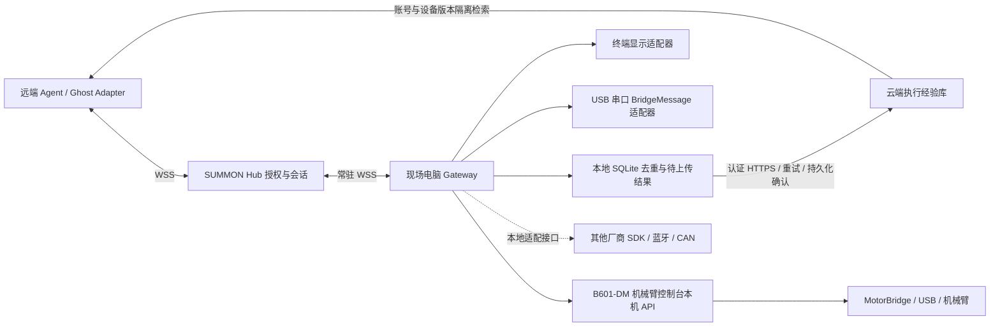

# SUMMON Gateway：让现场电脑连接硬件与云端 Agent

Gateway 是独立运行的 Python 程序，源码位于仓库 gateway/。一份配置对应一具逻辑壳、一个本地数据库和一条出站 WSS；多台设备可运行多个实例。设备无需自带 Wi-Fi，只需有可调用的 USB/串口或厂商接口，现场电脑负责联网。

Windows `--tui` 已支持 [铭牌与设备授权](NAMEPLATES.md)：A 配对、B 打开授权网页、L 查询铭牌目录、M 输入铭牌、C 确认连接、T 输入任务、R 释放、Q 退出；输入模式按 Esc 返回。授权只存内存，退出或 Hub 重启须重新配对。

桌面适配器 kind=desktop 增加 [白名单浏览器打开](BROWSER-TEST.md) 和需本地启用、用户单独授权的 [PowerShell 命令执行](COMMANDS.md)。普通显示/串口适配器不自动获得命令能力。

## 架构



已经实现：终端 display.text、串口显示桥、租约/序号/截止时间校验、执行前持久化去重、断线停止、恢复不重放、结果补传和云端保存确认。终端完成表示本地输出写入并 flush；串口完成必须有匹配 command_id 的 device.result。两者都不是机械臂抓取成功证明。

B601-DM 已有 `arm-console` Gateway 适配器；通用蓝牙驱动、NFC 读卡和固件烧录仍需另行适配。新增驱动实现 open/healthy/execute/stop/close，并声明 capabilities 与 stop_kind；普通硬件动作不接受模块名、shell 命令或原始电机帧。执行 PowerShell 必须走单独授权的 command.exec。运动适配器必须先经过现场物理停止验收。

## 笔记本作为 B601-DM Gateway

**拓扑：远端设备上的 Agent／Ghost Adapter ↔ Hub ↔ 本笔记本 Gateway ↔ 本机 Arm Console ↔ USB 机械臂。** Gateway 和 Agent 都主动连接 Hub；远端设备不直连笔记本的控制台端口，也不持有串口或 Gateway token。Hub 负责会话、授权、能力交集和回执转发。每个 `shell_id` 是一具逻辑壳；同一笔记本要同时接其他设备时，为每具壳另起 Gateway 实例、独立 token 和数据库。

适配器提供 `arm.observe`（六轴实测角、末端位置、负载和模型净空）、`arm.motion`（模型提出短路点）与 `arm.gesture`（本地已录制预设）。远端 Agent 不能传串口帧；自由动作只可使用笔记本配置 `motion_bounds` 中已验证的 J1–J6 窗口和 `max_motion_speed_dps` 上限。每段最多 2–4 个相对路点，末点回到起始角，单轴偏移不超过 10°、速度 0.5–10°/s、预估整段不超过 5 秒。执行前读取真实关节角，以仓库 DM URDF/STL 按每不超过 1° 检查整段自碰撞与桌面边界；模型重合、触桌或低于本地已验证 `min_clearance_mm` 的轨迹均拒绝，默认阈值为 20 mm。随后重新读取实机姿态确认未漂移，按路点下发，运动中持续核对实测模型边界和未控制轴漂移，并等待真实角度、运动状态和目标值回执。失败、断线或租约撤销时调用控制台的停止并保持命令，且必须确认姿态稳定才向 Hub 回停止成功。机械臂断开、仿真、反馈过期或故障时拒绝上线。[实机演示、主臂遥操与录制命令](ARM-LIVE-DEMO.md) 给出了本地 Hub 和六轴控制流程。

`gateway/arm-example.json` 是**不可直接启动的模板**：`physical_estop_confirmed` 和 `motion_profiles_verified` 默认都是 `false`。示例角度只是格式说明，不代表另一台机械臂已验证。先在现场固定底座、清空工作空间、验收物理急停，再在本地控制台逐段验证并录制每个预设，确认承重/支撑状态、模型外障碍和电机反馈；完成后才改为 `true`。Gateway 的 `stop_kind=physical_estop` 表示现场必须具备且验收过物理急停；程序本身只发软件停并保持，不能触发物理急停。J2/J3 需要 J4 支撑、J6 需要 J2/J3 起身等联锁由控制台驱动执行。模型几何检查不能识别人员、线缆或外部支撑。

笔记本部署步骤：

1. 使用含 `numpy`、`pinocchio`、`motorbridge` 的现场 Python 环境安装 `gateway/requirements.txt`；控制台部署步骤见 [`arm-console/README.md`](../arm-console/README.md#启动)。在 `arm-console/` 工作目录启动 `python -m backend.app --allow-hardware`，再在本机控制台**人工**连接正确串口。Gateway 不会自动打开串口；本机控制台不要开放到公网。
2. 复制 `gateway/arm-example.json` 到私有目录，填 Hub URL、由部署者分配的专用 `shell_id`、`mode`、`profile` 和已现场验证的短动作。`mode=LIVE` 需要 Hub 同为 LIVE；不要和 SIMULATED 实例共用壳身份。把专用 Gateway token 放入 `SUMMON_GATEWAY_TOKEN` 环境变量，运行 `python -m gateway --config <私有配置路径> --tui`。使用哪个 Python 启动 Gateway，就必须在该环境内具备模型依赖。
3. Hub 部署者给该 `shell_id` 单独登记 token 与 profile，并设置 `shell_policies`：`capabilities`、`allowed_actions` 均为 `["arm.observe","arm.motion","arm.gesture"]`，`stop_kind` 为 `physical_estop`，按授权方式设置 `identity_gates`/`gate`。这些值必须与本地 Gateway 配置匹配；不要把 token 放进仓库。当前公开仓库的默认显示壳策略不会自动变成机械臂权限。
4. 远端模型 Agent 注册时声明 `arm.observe`、`arm.motion`、`arm.gesture`，在授权会话中先观察，再基于实测姿态请求动作。现有 `hub.passport_agent` 通过私有配置 `"enable_arm_planning": true`、`model`、`motion_policy` 和 `gesture_catalog` 注册为新的机械臂 Agent；模型从预设理解动作效果，也能在本地角度窗口内提出新的短动作。已有不带此能力的 Agent 身份不能原地扩大权限，需另建 Agent 身份及凭证。Gateway 仍做独立校验。若会话壳只提供机械臂，Agent 不向该壳发送 `display.text`；文本反馈在远端 Agent 自己的界面处理。

机械臂未连接时，第 2 步的 Gateway 启动会拒绝进入 READY；这表明上线条件没有满足。单元测试使用本机假控制台，不会打开 COM 端口。运行 `python -m unittest tests.test_gateway_arm tests.test_passport_agent tests.test_arm102_teleop -v` 可验证动作窗口、模型阻止写入、实测回执、停止及遥操联锁。

## 经验上传声明

**接入此网络后，设备执行结果会上传至配置的 SUMMON 云端 Hub，用于形成设备经验、统计与后续 Agent 检索。** 启动日志会显示这项声明，配置必须显式设置 experience_upload=true；不接受上传时不启动网络接入。

- 上传关联的 session_id/command_id、完成/失败/未知状态、完成证据类型和有界结果说明。设备型号、固件/适配器版本、模式与账号归属由云端授权配置和会话补齐；设备不能自报另一个用户。
- 专用经验表只存执行元数据、回执类型、耗时、设备版本和统计，不存原始动作参数、对话、音视频。普通命令/补传回执表仍按协议保存请求和结果；不能把“经验表不存正文”解释成“整个服务器不保存命令正文”。终端显示与串口显示返回固定完成说明；command.exec 另回传 stdout/stderr 各最多 500 字符及退出码，并存入命令回执与本地补传库。
- 当前默认是当前 operator 账号内共享；其他账号不可读取，不自动公开到全网或上传 EvoMap。SIMULATED 与 LIVE 分开，版本指纹改变后不混用统计。Gateway token 不能读取用户的经验或记忆。
- 网络中断：本地保留待上传结果，联网后重试同 command_id，收到云端 stored=true 才标记已上传。动作不会因重连而再次执行。
- 云端已判 UNKNOWN 时，晚到的设备结果保存在 gateway_receipts 审计记录，原 UNKNOWN 和经验统计不自动改成成功，也不会恢复旧会话。late=true 明确区分晚到观察；当前控制台不展示此附加审计记录。
- 本地库存动作散列、会话/序号、终态与补传状态；command.exec 的终态含有界命令输出。不存 Gateway token 或原始命令参数。记录目前无自动过期清理，比赛规模使用；扩展部署需制定保留/删除策略。经验是执行证据，不代表模型已训练出控制技能。

## 启动终端壳

在仓库根目录执行（Python 3.10+，Linux/macOS 按实际使用 python3）：

```sh
python -m pip install -r gateway/requirements.txt
python -m gateway --config /path/to/gateway.json
```

需要终端状态界面时增加 `--tui --log-file /path/to/logs/gateway.log`。界面滚动显示连接、会话、任务终态、云端保存确认与重连日志。Windows 交互终端支持 Q 停止并退出、B 打开控制台；Ctrl+C 也可退出。日志自动轮转，不写入凭证或动作正文，终端适配器的任务文本仅显示在窗口。首次网络暂不可用时会自动重试；凭证或配置错误会明确报错退出。

先将 gateway/example.json 复制到自己的私有目录，填写 shell_id、Hub 地址、profile 和本地数据库路径。通过环境变量 SUMMON_GATEWAY_TOKEN 提供部署者发放的专用 token；不要把 token 写入仓库或命令行参数。CLI 启动显示上传声明，读到错误的模式、型号/版本、动作白名单或停止方式时拒绝接入。

Windows PowerShell 可在私有终端设置 `$env:SUMMON_GATEWAY_TOKEN`；Linux/macOS 使用同名环境变量。不要在共享终端中回显该变量。数据库路径相对于配置文件目录；每个 Hub/shell_id 使用独立数据库，切换身份会被拒绝。停止程序使用 Ctrl+C，会走本地停止流程。无网络时不能接新动作。

部署者配置示意（所有 token 均由部署者私密配置）：

```json
{
  "gateway_tokens": {"pc_terminal": "<private token>"},
  "shell_labels": {"pc_terminal": "现场电脑终端"},
  "shell_policies": {"pc_terminal": {
    "capabilities": ["display.text"], "allowed_actions": ["display.text"],
    "identity_gates": ["web"], "stop_kind": "local_disable", "gate": "whitelist"
  }},
  "device_profiles": {"pc_terminal": {
    "model": "PC Terminal", "firmware": "host", "adapter_version": "terminal-1"
  }},
  "demo_shell_ids": []
}
```

实际配置需合并已有 origin/mode/operator/数据库等字段，不能覆盖其他设备凭证。SIMULATED 模拟器只连接 demo_shell_ids 指定的壳，真实 Gateway 不得与模拟器争用同一身份。不要为对齐话术而登记未实现的 NFC 或 physical_estop。

## USB 串口显示桥

adapter 配置为：

```json
{"kind":"serial-display","port":"COM6","baudrate":115200,"device_id":"passport_a"}
```

Linux 可显式指定 /dev/ttyACM0。端口必须人工/SDK 核对身份，不自动选第一个 COM；打开端口可能使某些开发板复位，应按板型准备。当前只支持实现 SUMMON BridgeMessage 的设备固件，不是任意串口设备即插即用。

传输为 UTF-8 JSONL，每行一个已有 BridgeMessage，含换行最多 16384 字节。设备连接后发送 device.hello（device_id 与 shell_id 必须匹配配置），双向每秒 heartbeat。Gateway 发 device.command；设备真实渲染完成后发 device.result(COMPLETED)。停止使用 device.stop/device.stopped，必须回送匹配的 session_id 与 lease_epoch；3 秒无设备心跳即视为故障。不承诺“发出串口字节”就是“设备完成”。USB 本地身份绑定由已授权电脑与明确端口承担，不通过该明文串口发送云端 token。

## 云端接口与验收

- GET /v1/gateway/config：Gateway Bearer token；返回所属 Shell、模式与部署批准的 profile，用 GatewayConfig 校验。
- POST /v1/gateway/results：Gateway Bearer token，无需 Origin；请求是 GatewayResult（ActionCompleted 或 ActionFailed），返回 GatewayReceipt：command_id/stored/late。只接受云端已登记且属于该 shell 的命令，不能制造经验或跨设备上传。
- 同 ID 同内容重试返回同一确认；不同内容 409。永久 401/403 停止重试；结果冲突保留本地库供核对。临时网络失败指数退避，补传与心跳分离。

测试入口：`python -m unittest discover -s tests -p test_gateway.py -v`。覆盖终端执行→云端经验、权限隔离、重复上传、云端不可用后补传、晚到回执、崩溃去重、延迟握手与配置一致性。串口适配器仍需匹配固件实物验收；模拟或虚拟串口测试不能代替实物。

2026-09-22 已通过公网 Hub → 本机 Gateway → 本机终端 → 云端经验与持久化确认的跨机器联调，记录见 [验收结果](https://github.com/rfdiosuao/summon-protocol/blob/main/docs/gateway-cloud-smoke-20260922.json)。Agent 是远端规则模拟器，模式仍为 SIMULATED；本地终端确实写入，但未测试实物硬件。记录中的 scenario_total_ms 包含登录与轮询，不是动作延时指标。
