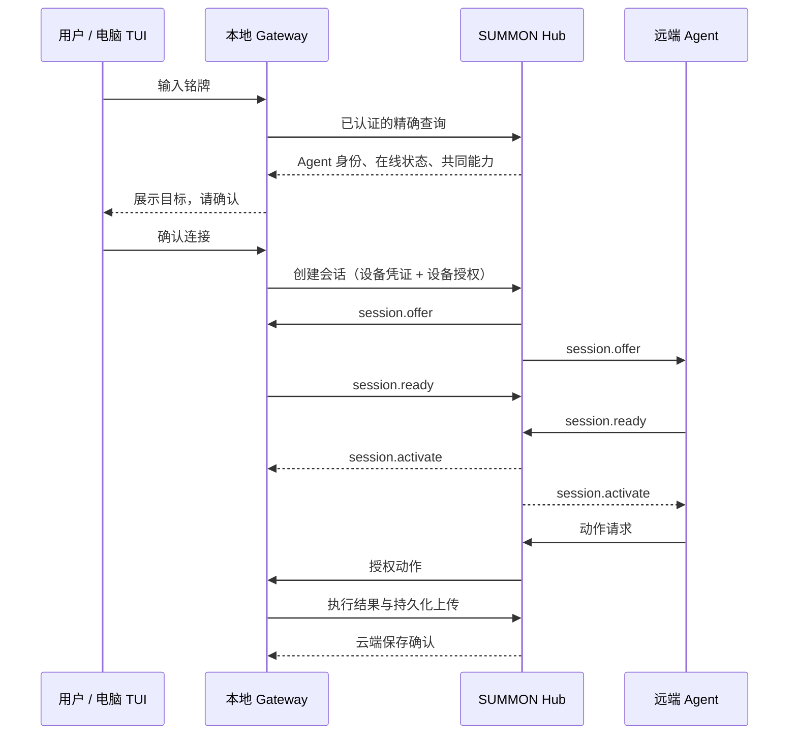

# 铭牌机制与电脑客户端设计

状态：原设计保留，2026-09-22。固定铭牌、设备配对授权、会话接口与 Windows TUI 已实现；实际接口与取舍以 [已实现契约](NAMEPLATES.md) 为准。铭牌注销、跨平台 TUI 等未交付项不因本文设计而自动视作实现。

## 1. 用户体验与边界

铭牌是 Agent 的稳定公开寻址入口。模型留在远端，现场 Gateway 将经过授权的设备能力交给它。铭牌不是登录密码，不赋予设备控制权，也不是固件下载地址。

首次使用电脑：双击启动 → 设备联网 → 浏览器完成设备授权 → 回到终端输入铭牌 → 显示 Agent 与允许能力 → 确认连接 → 等待双端握手 → 使用设备。授权有效期内不重复登录；每次更换 Agent 都先显示身份与能力并确认。

同一铭牌可先后用于电脑、开发板或机械臂。第一版维持当前契约：一台设备一个控制会话，一个 Agent 同时只能持有一台设备。并发请求返回忙碌，不偷偷抢占或排队；跨设备迁移沿用已有 handoff 和停止确认。



## 2. 铭牌格式与生命周期

建议正式输入码采用 `SMN-7K2M-9Q4X`，展示为“阿岚 · SMN-7K2M-9Q4X”。8 位随机字符采用不含 I/L/O/U 的 Crockford Base32 字符表；随机值只用于唯一性，不作为秘密。使用密码学随机源生成，以数据库唯一约束处理碰撞并重新生成。

- 输入允许小写、首尾空白和省略分隔符，统一成规范格式。拒绝其他字符，不使用模糊匹配或悄悄替换相似字符。中文展示名不参与规范码解析。
- 一块铭牌只指向一个稳定 agent_id；第一版不改号、不自定义短码、不复用已注销号码。展示名沿用现有 Agent name，当前不额外增加改名接口。
- 名字搜索与铭牌精确查询分开。即使未来允许同名，输入铭牌仍唯一；没有精确结果就提示不存在，不能选最相近的 Agent。
- 离线不撤销铭牌；查询返回身份及离线状态。注销铭牌保留墓碑记录，旧码不能分配给另一 Agent。冻结后禁止创建新会话，并释放该 Agent 的存量控制会话。
- 二维码和 NFC 后续可编码 `summon://<agent_id>?v=1` 并同时展示铭牌。二维码也只是寻址线索，不能夹带 token。扫描结果必须经过同样的身份展示、授权及会话流程。

兼容策略：新增独立查询接口与铭牌表，不直接向严格校验的旧 Catalog、RegisterAgent 响应塞入字段。新 Agent 在注册事务中分配铭牌，旧 Agent 通过一次有版本记录的迁移补齐；GET 不隐式创建铭牌。注册幂等重试不生成第二个号码。

## 3. 服务端数据

| 数据 | 关键字段与约束 |
|---|---|
| nameplates | code 唯一主键、agent_id 唯一外键、status=ACTIVE/REVOKED、created_at、revoked_at；code 永不复用 |
| device_authorizations | grant_id、token_hash、operator_id、shell_id、允许能力上限、到期与撤销时间；明文授权 token 只在领取时返回 |
| pairing_requests | pairing_id、shell_id、短期 user_code 的散列、PENDING/APPROVED/DENIED/EXPIRED、expires_at、领取状态；只由所属 Gateway 创建和查询 |
| 现有 sessions | 继续使用 operator_id、agent_id、shell_id、lease_epoch、expires_at；可在单独审计记录关联来源铭牌，不改变旧响应 |

铭牌存储可沿用当前 SQLite Store，但需补数据库级唯一性和注册/迁移事务；不能只依赖 Python 内存去重。重启后号码不变。

授权归属必须由服务端登录后的 operator_id 决定，不允许电脑在请求体自报。铭牌本身无 operator_id；用户与 Agent 的记忆、设备经验仍按现有 operator 边界隔离。

## 4. 设备授权

现有 gateway token 只证明“我是这台设备”，不证明“当前操作者是谁”。因此不直接给它任意创建会话、读取记忆或查询账号经验的权限。

首次打开 TUI 时，Gateway 用设备凭证申请一个 5 分钟有效的配对请求；窗口显示一次性配对码，B 打开官方设备授权页。用户在浏览器使用现有 operator 登录，输入配对码，核对设备名、型号和能力后确认。授权页面不接受外部重定向 URL；配对码不要放访问日志、二维码或永久配置中。

Gateway 按服务器给出的间隔轮询自己的配对请求，批准后取得一个仅限本设备的随机授权 token。建议授权有效 8 小时：客户端仅存在内存，退出后重新授权；本地可保存最近铭牌，但不保存控制会话。授权到期或撤销时 Hub 释放会话，Gateway 仍能上报旧命令结果，但不能建立新控制会话。

配对审批 POST 校验 operator cookie、精确 Origin 与幂等键；配对码须限次尝试、到期失效，只能匹配一个请求。审批后不会立刻执行任务，TUI 仍需完成目标 Agent 确认。

授权 token 领取支持同 Gateway、同 request_id 的短期幂等恢复，避免响应丢失后凭证不可恢复；到期清理明文恢复材料，持久权限校验只保留 token_hash。授权不能跨 shell 使用，不能换取 operator cookie。

设备授权有效期、会话租约有效期和设备在线状态是三件事。8 小时授权不是 8 小时不断续租的控制权；第一版继续遵守现有 60 秒会话租约，到期释放，并由用户重新连接，不偷偷自动恢复。

## 5. 拟新增接口

以下是待实现的接口约定，不应由接入 Skill 当作线上可用接口调用。实施时必须补 JSON Schema、错误响应、路由和测试。

| 接口 | 认证 | 作用 |
|---|---|---|
| GET /v1/agents/me/nameplate | agent_token | 返回自己的铭牌，不返回其他凭证 |
| GET /v1/nameplates/{code} | operator cookie 或 gateway token | 精确解析可发现 Agent，仅公开身份和在线状态，不暴露记忆/账号/设备会话 |
| POST /v1/gateway/pairings | gateway token | request_id；创建或幂等返回本设备配对请求 |
| GET /v1/gateway/pairings/{id} | 所属 gateway token | 返回状态和下一次轮询间隔，不在 GET 返回授权 token |
| POST /v1/device-pairings/approve | operator cookie + Origin | request_id、配对码；确认授权对象与能力上限 |
| POST /v1/gateway/pairings/{id}/claim | 所属 gateway token | request_id；幂等领取本设备授权 token |
| POST /v1/gateway/sessions | gateway token + X-Summon-Device-Grant | request_id、铭牌、预览确认的 agent_id；服务端推导 shell 和 operator 后创建会话 |
| GET /v1/gateway/session | gateway token | 仅本设备当前会话和 Agent 身份，不返回 operator 私人资料或记忆 |
| POST /v1/gateway/sessions/{id}/release | gateway token | request_id；仅停止本设备会话；即使授权过期仍可停止 |
| POST /v1/device-authorizations/{id}/revoke | 所属 operator cookie + Origin | request_id；撤销授权并触发会话释放 |

机器接口精确列入 Origin 豁免清单，仍校验各自凭证；不豁免整个 /v1。铭牌查询限流并遵守未来 Agent 可发现性设置。浏览器与机器客户端使用不同的认证路径，不把 operator 访问码写入 Gateway 配置。

创建会话在同一服务端锁/事务内重新检查：授权仍有效且属于该 shell、铭牌仍有效且对应预览 agent_id、双方在线、设备本地启用、Agent/设备不忙、能力存在交集。最终允许能力为 Agent 能力、设备实现能力、部署白名单和本次设备授权上限的交集。不能只信查询时的旧状态。

创建与释放均复用现有幂等语义：同 key 同请求返回同一结果，内容不同冲突。202 只代表 CONNECTING，双方 ready 并收到 activate 才显示已连接。未授权 401/403、不存在 404、忙碌/幂等冲突 409、不兼容 422、离线 503；业务细分错误码需在新增 Schema 中明确，不能沿用一条泛化“失败”。

授权过期与设备主动退出都会停止，结果补传权限继续由原 gateway token 和命令归属控制。公开铭牌查询不能查询谁正在使用设备。

## 6. 电脑客户端界面

保持现有双击启动入口，升级 gateway/console.py 为单一输入状态机。状态栏固定，日志滚动；输入框和日志分区，日志刷新不能覆盖用户正在输入的铭牌。网络和按键处理不能阻塞当前 Gateway 的心跳、停止或结果补传。

```text
 SUMMON · 唤名                       SIMULATED
 设备：电脑终端              云端：已连接
 授权：有效，剩余 07:42       控制会话：未连接
 ────────────────────────────────────────────
 Agent 铭牌：[ SMN-7K2M-9Q4X                 ]
 查找结果：阿岚 · 在线
 可用能力：显示文字
 [连接]  [最近使用]  [返回]
 ────────────────────────────────────────────
 经验：云端同步开启，待上传 0 条
 19:40:08 设备已连接 Hub，等待选择 Agent
 19:40:12 铭牌解析成功，等待本地确认
 ────────────────────────────────────────────
 Esc 返回  B 控制台  Q 退出（非输入模式）
```

界面状态：启动自检 → 连接云端 → 等待授权 → 输入铭牌 → 查询中 → 目标预览 → 连接中 → 会话激活 → 释放中 → 输入铭牌。离线、权限到期、忙碌、配置错误分别有明确页面，不把所有错误都记成“网络问题”。待上传数量与云端保存确认沿用已实现日志。

- 铭牌输入页：支持粘贴、退格、编辑；输入模式的 Q/B 都是普通字符，不触发退出/浏览器。Enter 发起查询；Esc 返回，不保存半填内容。
- 目标预览页：显示规范铭牌、名称、agent_id 简写、在线状态、有效能力和 SIMULATED/LIVE；能力无交集时连接按钮不可用并解释原因。
- 已连接页：显示当前 Agent、剩余租约、当前任务、最近执行结果、经验待上传数。提供输入任务、释放、切换 Agent、查看日志和控制台入口。任务输入需复用/新增经过设备授权限定的 submit 接口后才能启用，不能直接假设 gateway token 可调用旧 operator inputs 接口。
- 切换 Agent：先停止并释放旧会话，等 RELEASED 后进入新目标确认。停止超时或结果 UNKNOWN 时阻止下一次连接，给出检查设备提示，不能靠关页面绕过。
- 最近使用：只存规范铭牌和展示名缓存；再次选择必须重新查询最新身份状态。启动可以预填上一次铭牌，但不自动恢复会话。
- Q 退出：停止本地执行，发送本设备释放请求，保留未上传结果，显示最终退出状态。Hub 不可达时仍优先本地停止，不无限等待网络。窗口标题标明设备与模式。
- 普通 PC 键盘使用 Enter 确认、Esc 返回。设备式“确认键”模式可选启用双击返回：延迟单击提交，双击仅返回；不能与终端键盘自动重复混为一谈。固件仍必须遵守 firmware-ux.md 的确认键规则。

## 7. 经验与审计

每次执行沿用 command_id、session_id、agent_id、shell_id 与设备版本归因，云端保存后才显示“已同步”。铭牌只作可选展示快照，不能代替稳定 ID 或改变账号归属。配对码、Wi-Fi 密码、设备授权 token 和 operator 访问码不进入日志及经验。

GitHub 保存产品规则与脱敏验证结果；云端保存账号范围内的设备执行经验。输入铭牌不会把这两类数据自动公开。

## 8. 实施顺序与验收

1. 服务端：铭牌表、唯一迁移、精确查询、自身铭牌接口，保持旧 Catalog/注册兼容。测试重启稳定、注册重试、碰撞、大小写、注销不复用与越权查询。
2. 授权与会话：配对、审批、授权领取、作用域、到期撤销、创建和释放。测试冒用 shell、跨账号、授权过期、重复请求、双请求竞争、领取丢包与双端 ready。
3. 电脑 TUI：完成输入状态机、预览、连接、释放、切换、日志分区。验证输入 Q/B 不误触、长日志不破坏输入、断线仍可返回、双击入口不闪退。
4. 公网联调：铭牌解析 → 授权 → 电脑终端执行 → 云端经验确认 → 释放 → 换铭牌；验证 Agent 离线、忙碌、无共同能力、重启不重放。
5. 固件复用同一机制：手机本地配网页收集铭牌，授权与会话走正式接口；具体 SoftAP 与按键实物验收独立进行。

交付时分别报告服务端 API、客户端交互、模拟端到端、真实模型和实物硬件状态。本设计不承诺对尚未接入的机械臂执行动作。
